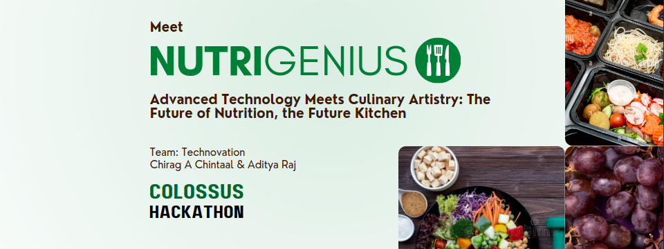
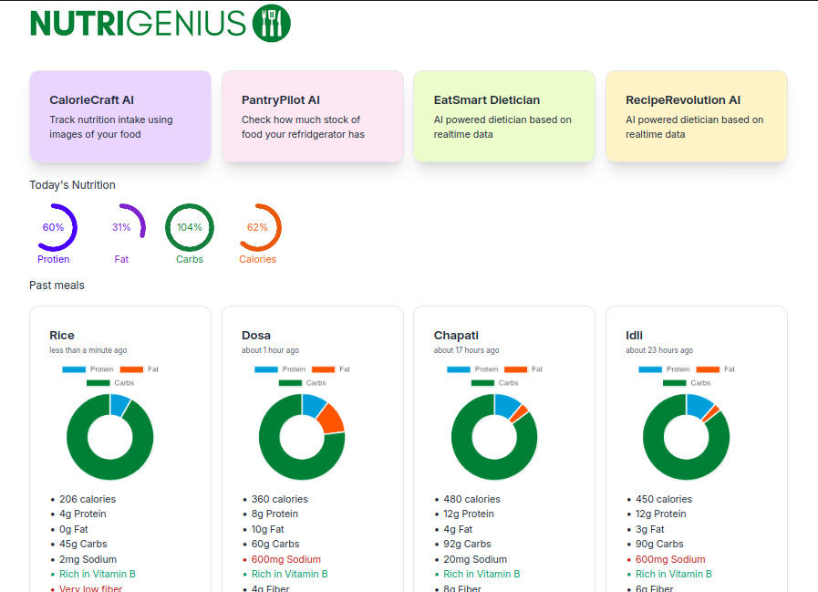
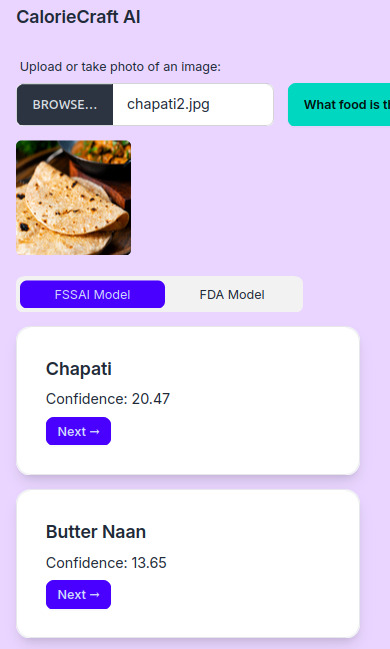
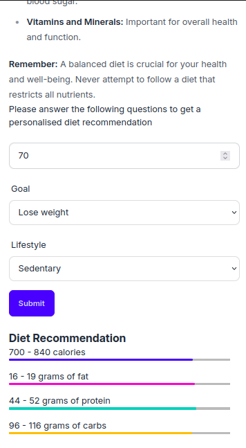
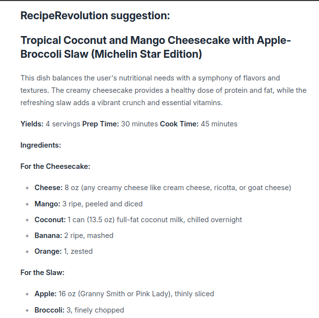
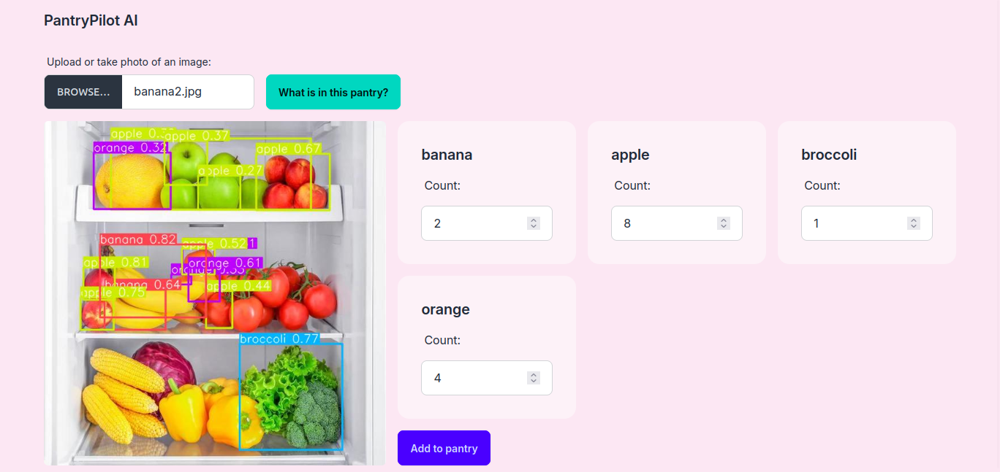
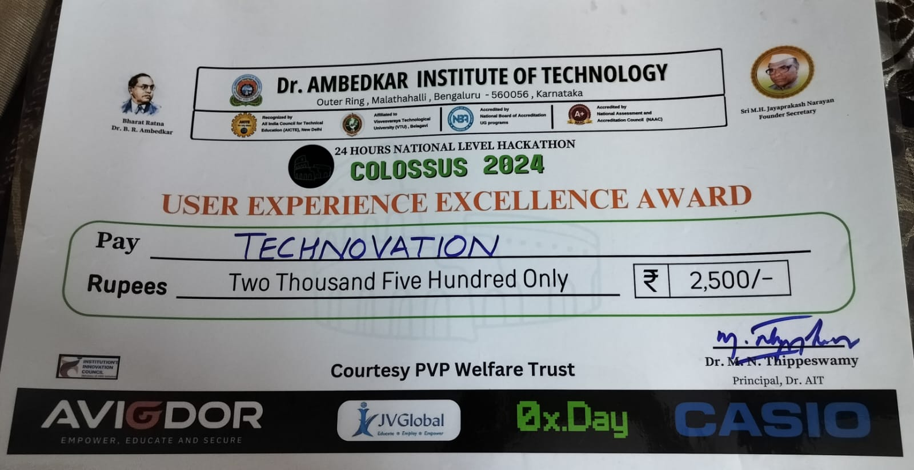
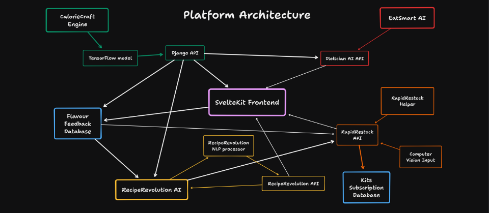

# Nutrigenius
This was a project done in _**Colossus Hackathon 2024**_ - A 24 hour offline hackathon conducted at Dr. Ambedkar Institute of Technology

Our team consisted of me and Chirag A Chintaal from RVCE

This project won the **"User Experience Excellence Award"** in the hackathon

## UI Screenshots

## Certificate

## Platform architecture

## Technologies Used
- Django
- Django Ninja
- Sveltekit
- FastAPI (Only for the YOLOv5 API)
- TailwindCSS
- SQLite
- Pytorch (To train and use Indian model)
- Tensorflow (To use the US tflite model from [nutrify](https://github.com/mrdbourke/nutrify))
- JWT Authentication
- Taskfile

[Hackathon Presentation](./assets/presentation.pdf)

## Special thanks
Thanks a lot to the Colossus organisers for managing the hackathon so well. It was their first time organising a hackathon, and they did amazing <3.